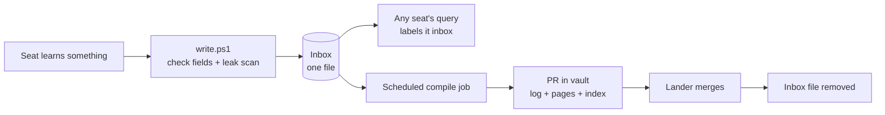
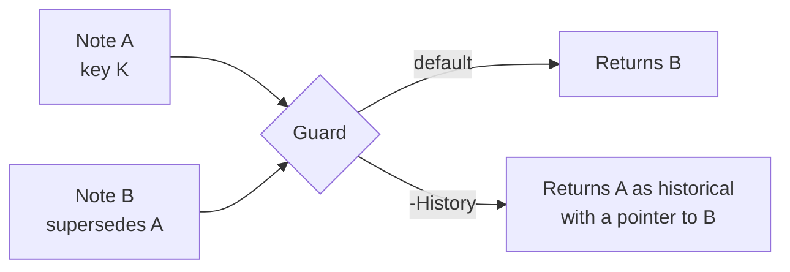

# Fleet Wiki Mental Model

As of 2026-09-23. Companion to [spec.md](spec.md) and [plan.md](plan.md).

The fleet wiki is one shared notebook for every seat on every account. Seats drop notes in
instantly, a scheduled job files them into an append-only log in the vault, and every search hides
notes that were replaced.

## Five pieces, and only the inbox takes writes from seats

Think of a shared lab notebook. The inbox is the tray where anyone drops a page. The log is the
bound notebook nobody tears pages out of. The pages and index are the typed-up summary a clerk
rebuilds from the notebook.

| Piece | What it holds | Where it lives | Who writes it |
| --- | --- | --- | --- |
| Inbox | New events, one JSON file each, not yet filed | `.git/mefor-coord/wiki/inbox/` (shared by all six accounts) | Any seat, through `write.ps1` only |
| Event log | Every event ever accepted; never edited or deleted | Vault repo, `wiki/events/<yyyy>/<mm>/<id>.json` | The scheduled compile job |
| Pages | One readable page per topic, rebuilt from the log | Vault repo, `wiki/pages/` | The scheduled compile job |
| Index | One line per page, read before every search | Vault repo, `wiki/index.md` | The scheduled compile job |
| Schema | The rules for writing, compiling, searching, linting | korus, `roles/WIKI.md` | A normal pull request |

The log is the truth. Pages and the index are copies that can always be rebuilt from it.

## A note is searchable the moment it is written, and permanent once compiled

The write never touches git or the network, so it takes under a second. The note is visible to
every account straight away. Filing it into the vault waits for the next compile and a normal
merge.

1. A seat runs `write.ps1` with a type, a key, a summary and its evidence.
2. The script stamps the time from the clock and runs the leak scan. It refuses a secret or a note
   with no evidence.
3. The note lands as one file in the inbox. Two seats writing at once make two files, so they
   never conflict.
4. On schedule, the compile job moves inbox notes into the log and rebuilds the pages and index in
   one vault pull request.
5. The inbox file is deleted only after that pull request merges, so a crash loses nothing.

## A seat asks before it acts, writes after, and trusts the tree over the note

Every result comes back with its id, date, writing seat, evidence and an age label. A seat cites
the id when it acts on a note.

| Label | Means |
| --- | --- |
| `inbox` | Written, not yet compiled |
| `fresh` | Under 14 days old |
| `aging` | 14 to 45 days old |
| `stale` | 46 days or older; check it before acting |
| `historical` | Replaced; shown only when you ask for history |

Four rules keep the notebook honest:

- **Recall is advice, not authority.** If a note disagrees with the tree, a live instrument or the
  Owner, the note loses. The seat acts on the live reading and writes a `correction` event.
- **No match means no match.** A weak search prints `no note` instead of the nearest wrong answer.
- **A memory miss never blocks work.** If the store is unreachable, the query says so and the seat
  carries on.
- **One way in.** Only `write.ps1` adds notes, so every note gets the same checks.

## Forgetting is done by adding a note, never by erasing one

The research behind this design found that memory systems fail at forgetting, not remembering. A
replaced fact keeps coming back and can outrank its replacement. The wiki forgets in three steps.

1. **Every note has a key**, a stable name for what it is about, such as
   `gate/ascii/windows-exit-code`. Within one key, the newest live note wins. Text similarity plays
   no part, because it cannot tell a contradiction from a rewording.
2. **Retiring is a new event.** A `supersede` event names the note it replaces. A `retire` event
   withdraws a key with nothing in its place. The old note stays in the log untouched.
3. **Every read passes one guard.** The guard hides superseded and retired notes unless the seat
   asks for history.

**The rebuild test proves it.** Plant A, supersede it with B, delete every page and rebuild from
the log. A must stay hidden. The same rebuild with the guard switched off must show A, or the test
is not measuring anything.

A weekly import of each account's own memory follows the same rule. A note that has not changed
adds nothing. A note that has changed adds a new event on its key, which replaces the old one.

## No new seat: seats write, a scheduled job files, the Lander lands, the Owner approves

| Who | Does | Never does |
| --- | --- | --- |
| Any seat | Queries before acting; writes decisions, lessons, gotchas and corrections | Edits the log, the pages or the index |
| Scheduled Claude Code job | Compiles the inbox, runs the weekly import and lint, opens vault pull requests | Merges anything |
| Lander | Merges the job's vault pull requests like any other | Picks a winner when two notes conflict |
| Owner | Lists which memory folders the import reads; approves or closes playbook changes lint proposes | Hand-edits the log |

Lint reports four things: notes that conflict, notes whose evidence is gone, pages nothing links
to, and lessons written by two or more seats. The last kind becomes a drafted korus pull request,
so a lesson learned twice can become a playbook rule. Nothing changes a playbook without the Owner.

Both Owner rulings behind this table were given on 2026-09-23 and are recorded in the spec.

## Three things it deliberately is not

| Not this | Because |
| --- | --- |
| A vector database or embedding service | An index file plus `git grep` covers a few hundred pages, which is Karpathy's own limit. `qmd` can be added later as an optional search. |
| OKF Agent Memory | Its search never checks whether a note is deprecated, it retires by editing in place, and every writer edits one shared file per concept. We borrow its `stale_after` date, its generated/verified trust split and search by file path. |
| Content in the korus repo | korus is public and the notes name accounts, branches and internal detail. korus holds the method and scripts; the vault holds the notes. |

Obsidian works as an optional viewer: point it at `wiki/pages/` in the vault. No seat depends on
it.

## Sources

- [Karpathy, LLM Wiki idea file](https://gist.github.com/karpathy/442a6bf555914893e9891c11519de94f)
- [Revoked but Still Authoritative, arXiv 2609.08258](https://arxiv.org/abs/2609.08258)
- [Temporal Validity in Retrieval Memory, arXiv 2606.26511](https://arxiv.org/abs/2606.26511)
- [okf-memory/okf-agent-memory](https://github.com/okf-memory/okf-agent-memory)
- [tobi/qmd](https://github.com/tobi/qmd)
